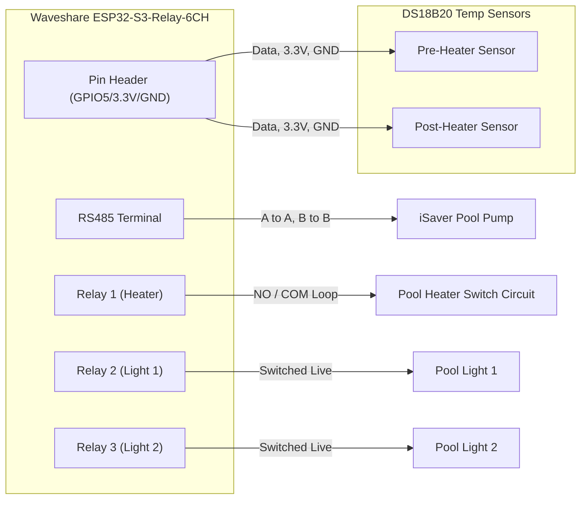

# Building the AquaSync Pool Controller with Waveshare ESP32-S3 and ESPHome

Automating pool equipment has traditionally been difficult due to proprietary protocols and expensive controllers. In this guide, we'll walk through how to build a fully capable, Home Assistant-integrated pool controller using the **Waveshare ESP32-S3-Relay-6CH** board.

This controller will handle:
- **Heating Control**: Interlocking the heater with the pool pump to ensure water flows safely over the heating element.
- **Variable Speed Pump Integration**: Controlling an iSaver frequency inverter pump via Modbus RS485.
- **Lighting**: Operating two standard pool lights using built-in relays.
- **Temperature Monitoring**: Using DS18B20 1-Wire temperature sensors for accurate pre- and post-heater measurements.

## Hardware Selection

### The Brain: Waveshare ESP32-S3-Relay-6CH
The Waveshare board is an industrial-grade relay board with a built-in ESP32-S3 microcontroller. It’s perfect for this application because:
- It provides 6 independent 10A relays, easily covering our heater and dual-light requirements.
- It includes an **onboard isolated RS485 interface**, which is necessary for Modbus communication without requiring extra breakout modules.
- It can be powered securely via a 7-36V DC terminal block.

### Sensors: DS18B20
We use Dallas DS18B20 temperature sensors because they use a simple 1-Wire protocol, allowing multiple sensors to be chained onto a single GPIO pin (GPIO5 in our case). We measure the temperature "Pre-Heater" to drive the thermostat and "Post-Heater" for diagnostics to ensure the heater is effectively warming the water.

## Wiring Diagram

Here is a high-level overview of how the components physically connect to the Waveshare controller:


> [!IMPORTANT]
> **1-Wire Resistor:** Don't forget to add a 4.7kΩ pull-up resistor between the `3.3V` and `Data` lines of your DS18B20 sensors!

## Software Architecture (ESPHome)

The magic happens within ESPHome, which natively compiles our configuration into ESP32 firmware and automatically integrates with Home Assistant.

### 1. Handling the Non-Standard iSaver Modbus
The iSaver pool pump inverter operates over RS485, but it does *not* use a standard Modbus RTU protocol that ESPHome’s built-in `modbus_controller` can understand out-of-the-box.

Instead, we use ESPHome's **Custom UART Lambdas**.
- **Hardware setup:** The Waveshare RS485 transceiver is mapped to `TX: GPIO17` and `RX: GPIO18` at `1200 baud`.
- **Command Injection:** We define a `number` component for the Target RPM. When you adjust the slider in Home Assistant, an ESPHome lambda manually calculates the hexadecimal payload, generates the CRC checksum, and writes the byte array directly to the UART bus.
- **Polling Loop:** An `interval` runs every 5 seconds, writing the "Read Current RPM" byte array, waiting for a response, and updating an ESPHome `sensor` so Home Assistant knows exactly how fast the pump is spinning.

*(Note: Most modern RS485 chips on Waveshare boards handle Direction Enable (DE) and Receiver Enable (RE) automatically. If communication fails, you may need to define a `modbus_write_enable` pin to manually toggle TX/RX states).*

### 2. The Relay & Climate Interlock
Safety is critical in pool automation. A pool heater should **never** activate if the pump is off, as stagnant water will boil inside the heater, potentially causing catastrophic damage.

We enforce this through an ESPHome **Interlock**:
```yaml
switch:
  - platform: gpio
    pin: GPIO1
    id: heater_relay
    name: "Pool Heater Relay"
    on_turn_on:
      - if:
          condition:
            lambda: 'return id(isaver_freq_inverter_pool_pump_current_rpm).state == 0;'
          then:
            - switch.turn_on: isaver_freq_inverter_pool_pump_power
            - delay: 2s
```
Whenever the heater relay is commanded on, the firmware checks the pump's current RPM. If the pump is off (`0 RPM`), ESPHome intercepts the action, turns the pump on to 2100 RPM, waits for 2 seconds, and *then* allows the heater to engage. 

### 3. Home Assistant Integration
Finally, we wrap the heating logic into a standard ESPHome `bang_bang` Climate Controller:

```yaml
climate:
  - platform: bang_bang
    name: "Pool Climate Controller"
    sensor: pre_heater_temp
    default_target_temperature_low: 27 °C
    default_target_temperature_high: 29 °C
    heat_action:
      - switch.turn_on: heater_relay
    idle_action:
      - switch.turn_off: heater_relay
```
This exposes a standard thermostat interface in Home Assistant. When the water drops below 27°C, the thermostat turns on the heater. The interlock then kicks in, turns on the pump, and the heating cycle begins seamlessly.

## Conclusion
By combining the Waveshare ESP32-S3 relay board with ESPHome's low-level UART control and high-level Climate components, we've built a robust, safe, and fully local pool controller. This setup eliminates cloud dependencies and provides an incredibly responsive automation ecosystem for your pool.

## References & Attribution

This project wouldn't be possible without the incredible work from the open-source community. Special thanks to:

- **[KIDNORswe](https://github.com/KIDNORswe)** for reverse-engineering the AquaGem Modbus protocol and creating the original [iSaver ESPHome implementation](https://github.com/KIDNORswe/esphome-esp32-iSaver-Controller) and C++ lambdas used in this project.
- The **[Waveshare ESP32-S3-Relay-6CH Wiki](https://www.waveshare.com/wiki/ESP32-S3-Relay-6CH?srsltid=AfmBOooYnODNxJmky1ajhuCY4HJ0btNSRWvQGp60dNBZosKBkRrFzUUa)** for hardware specifications and pinouts.
- The official **[ESPHome Devices Database](https://devices.esphome.io/devices/waveshare-6ch-relay/)** for providing the baseline ESP32-S3 relay configuration template.
