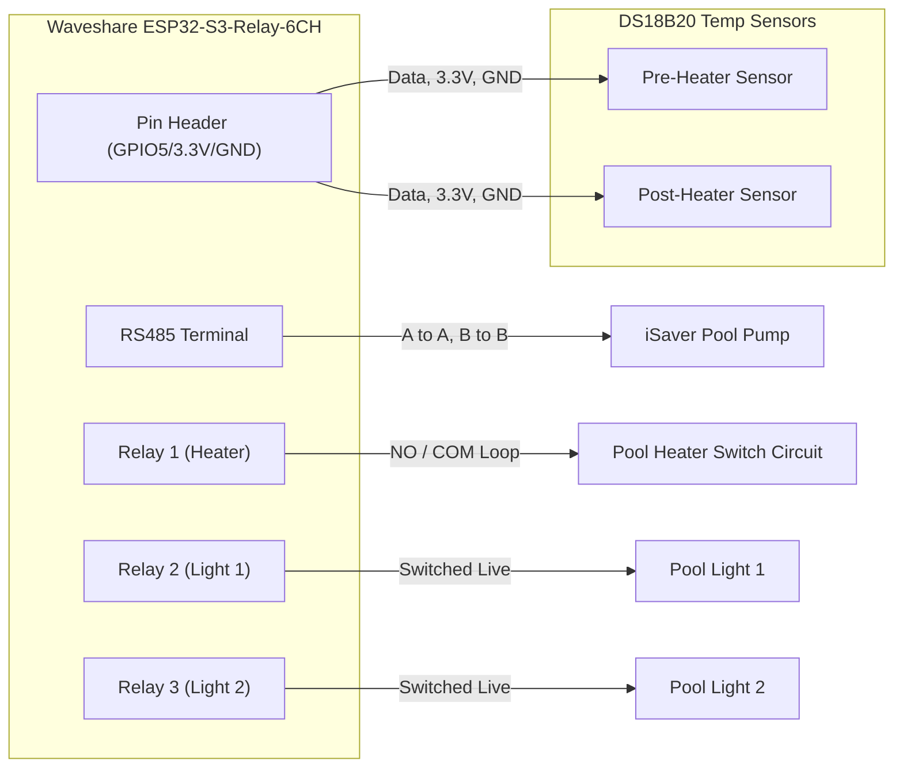

# AquaSync Pool Controller

A fully capable, Home Assistant-integrated pool controller built with ESPHome and the Waveshare ESP32-S3-Relay-6CH board. This controller automates heating, variable-speed pumps, pool lights, and temperature monitoring locally without any cloud dependencies.

## Features

- **Heating Control**: Interlocks the pool heater with the pump to ensure water flows safely over the heating element.
- **Variable Speed Pump Integration**: Directly controls an iSaver frequency inverter pump via Modbus RS485.
- **Lighting Control**: Operates two standard pool lights using built-in relays with a master toggle.
- **Temperature Monitoring**: Uses DS18B20 1-Wire temperature sensors for accurate pre- and post-heater measurements to drive the climate thermostat.

## Hardware Requirements

- **Waveshare ESP32-S3-Relay-6CH**: An industrial-grade board providing 6 independent 10A relays and an onboard isolated RS485 interface.
- **Dallas DS18B20 Temperature Sensors**: 1-Wire protocol sensors for measuring water temperature.
- **4.7kΩ Resistor**: Required pull-up resistor for the DS18B20 data line.
- **24V DC Power Supply**: To power the Waveshare board.

## Wiring Diagram

Here is a high-level overview of how the components physically connect to the Waveshare controller:



> [!IMPORTANT]
> **1-Wire Resistor:** A 4.7kΩ pull-up resistor must be connected between the `3.3V` and `Data` lines for the DS18B20 sensors to work reliably.

## Installation

1. Clone this repository.
2. Open `aquasync_controller.yaml` and update the `wifi` block with your network credentials.
3. Once powered on, use ESPHome to discover the 1-Wire addresses of your DS18B20 sensors from the logs.
4. Update the `address` fields under the `sensor` section in the YAML.
5. Compile and flash the firmware using the ESPHome CLI or dashboard:
   ```bash
   esphome run aquasync_controller.yaml
   ```

## Architecture & Logic

### iSaver Modbus Implementation
The iSaver pool pump inverter operates over RS485, but uses a non-standard Modbus protocol. This repository uses **Custom UART Lambdas** to handle the communication:
- Maps the Waveshare RS485 transceiver to `TX: GPIO17` and `RX: GPIO18` at `1200 baud`.
- Calculates hexadecimal payloads and CRC checksums on the fly when adjusting the target RPM.
- Polls the current RPM every 5 seconds.

### Safety Interlock
Safety is critical. A pool heater should **never** activate if the pump is off, as stagnant water will boil inside the heater. 

Whenever the heater relay is commanded on, the firmware checks the pump's current RPM. If the pump is off (`0 RPM`), ESPHome intercepts the action, forces the pump on to 2100 RPM, waits for 2 seconds, and *then* allows the heater to engage.

### Home Assistant Integration
The configuration wraps the heating logic into a standard ESPHome `bang_bang` Climate Controller. When imported into Home Assistant, it exposes a native Thermostat card. 

When the water drops below the target range (e.g. 27°C), the thermostat turns on the heater. The interlock then kicks in, turns on the pump, and the heating cycle begins seamlessly.

## References & Attribution

This project wouldn't be possible without the incredible work from the open-source community. Special thanks to:

- **[KIDNORswe](https://github.com/KIDNORswe)** for reverse-engineering the AquaGem Modbus protocol and creating the original [iSaver ESPHome implementation](https://github.com/KIDNORswe/esphome-esp32-iSaver-Controller) and C++ lambdas used in this project.
- The **[Waveshare ESP32-S3-Relay-6CH Wiki](https://www.waveshare.com/wiki/ESP32-S3-Relay-6CH?srsltid=AfmBOooYnODNxJmky1ajhuCY4HJ0btNSRWvQGp60dNBZosKBkRrFzUUa)** for hardware specifications and pinouts.
- The official **[ESPHome Devices Database](https://devices.esphome.io/devices/waveshare-6ch-relay/)** for providing the baseline ESP32-S3 relay configuration template.
